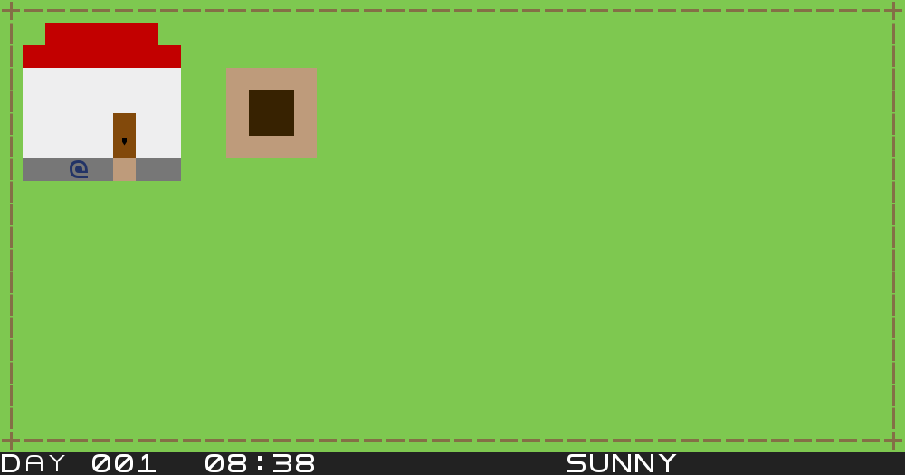
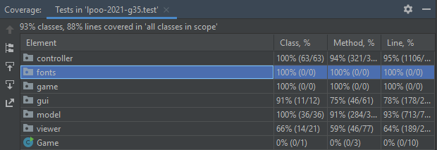

# LPOO_35 - FarmVille

FarmVille was an agriculture-simulation social network game developed and published by Zynga in 2009.

In this text-based implementation, you can manage a farm, including its crop fields and buildings.
You can also go to the market where you can buy and sell items, a house where you can rest, and a 
warehouse where your items are stored.

In this exciting new version you need to pay attention to the weather. Your fields need water to produce
but if it rains too much, or a storm comes, you might lose some or even all of your hard work.

This project was developed by Diogo Costa (up201906731@edu.fe.up.pt), Pedro Gonçalo Correia (up201905348@edu.fe.up.pt) and Rui Alves (up201905853@edu.fe.up.pt) for LPOO 2020-21.

## IMPLEMENTED FEATURES

- **Movement** - The farmer may be controlled with the WSAD keys, moving
as long as there isn't any obstacle (building or fence) obstructing his
way.
- **Interaction with crop fields** - Buildings and crop fields have light brown paths to mark
interactive positions. Pressing the SPACE bar when the farmer is in one such
position will trigger an interaction with that building (typically opening a
popup menu). For now, only crop fields have an action associated.
- **Popup Menus** - Popup menus are UI elements with labels and buttons that may be
clicked with the mouse (and are highlighted when hovered with the mouse).
These popups do not occupy the whole screen, so it is still possible to see
part of the farm. When a popup is opened, time in the farm passes as normal.
Right now, the menus implemented are used to plant, remove or harvest crops.
- **Crop field** - The crop field is used to plant crops. Right now, only
wheat can be planted. After planting, the crop takes some time to grow, during
which the farmer may remove the crop if he changes his mind. The gradual growth
of the crop may be seen visually when looking at the crop field, as the crops
get bigger as the harvest time is approaching. When the crop is ready to harvest
the farmer may harvest it. However, nothing will be given in return for now, as
the inventory and warehouse are not yet implemented.
- **HUD** - At the bottom of the farm screen, a HUD bar is displayed where the current
time and weather may be seen.
- **Weather** - From time to time (by random chance based on the current weather),
the weather can change, with possible weathers being sunny, cloudy, rainy,
windstorm and thunderstorm. For now, even though the weather may be seen
in the HUD bar, it has no other game effect.

### The farm with the farmer next to his home and a cropfield.

### An example of a popup menu

### A wheat crop in one of its earlier growth stages

## PLANNED FEATURES

- **More crops** - Instead of just being able to plant wheat, plant other
crops with different attributes, such as corn, tomatoes, carrots, potatoes...
- **Resting** - The farmer may enter the house to rest at any time, making
the in game time go faster so that the player doesn't have to wait so long for
the crops to grow.
- **Saving game** - The house may also be used to save the current game state,
which will be stored in a predefined file.
- **Main menu and pause menu** - When the game starts, instead of directly
opening the farm, open the main menu, where a new game may be created, if
there is currently a save, it may be loaded, and the player may exit the game.
Additionally, while in game, the player may pause the game with the ESCAPE button,
which will stop time in game and open a popup menu asking if the user wants to return
to the main menu.
- **Weather effects** - The current weather may affect the crop fields and animals
(positively or negatively). For example, a sunny weather may dry the plants, but
a windstorm may damage them.
- **Inventory and warehouse** - When the farmer harvests crops or gets products
from animals, they are stored in the warehouse. The farmer may go to the warehouse
to see the products currently stored. Be careful, however, as there is a limit
to the amount to products stored in the warehouse. It might be a good idea to
sell items before that limit is reached, because if there is not enough space
for more products, any new products obtained will be discarded.
- **Market and currency** - The market is where the farmer may go to sell the
products obtained in order to get money and to expand the farm by building more
crop fields or stockyards. Any new constructions must be placed without
intersecting existing constructions.
- **Animals** - Besides crop fields, the farm may also have stockyards. The
animals must be fed in order to produce something. For example, the farmer may
feed cows with wheat, wait some time, and then obtain milk from the cows.
- **Tools** - Some tools may be bought (and possibly upgraded) from the market
to aid the farmer in his work. There are many possible examples. A water bucket may
be filled in a fountain and used to water the plants the animals (which gives
bonuses). A hoe may be used to plow crop fields before planting crops (and thus
get a bonus). A knife may possibly be used to kill animals and get meat.
Scissors may be used to get wool from sheep.
- **Upgrades** - At the market there may be a possibility to buy upgrades
to the main buildings. Upgrading the House will make the time pass faster
while resting (it's easier to rest in a comfortable house). Upgrading the
market will increase the sell price of items and decrease the buying price.
Upgrading the warehouse will increase its capacity.

## DESIGN

> ### Problem1
>> #### Problem in Context
>> pic1
>
>> #### The Pattern
>> tp1
>
>> #### Implementation
>> i1
>
>> #### Consequences
>> c1
>
> ### Problem2 ...

## KNOWN CODE SMELLS AND REFACTORING SUGGESTIONS

> ### CodeSmell1
>> descrição1
>
>> refactoringSugestion1
>
> ### CodeSmell2 ...

## TESTING

### COVERAGE REPORT

### [MUTATION TESTING REPORT](../build/reports/pitest)

## SELF-EVALUATION

- Diogo Costa: %
- Pedro Gonçalo Correia: %
- Rui Alves: %
